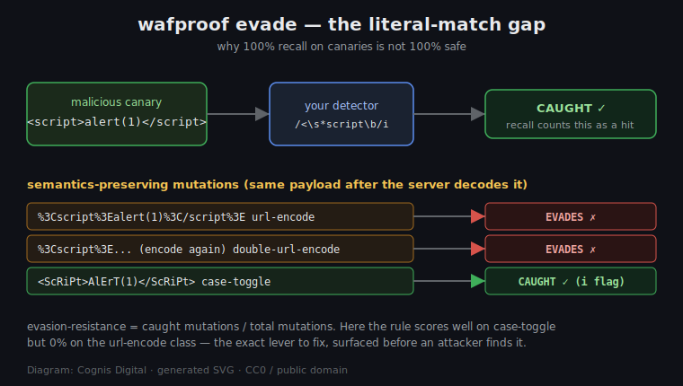

# Evasion-resistance and ruleset diagnostics

> Defensive tooling. Everything here runs against **your own** detector and
> **your own** corpus, entirely locally. wafproof never sends, fetches, or
> proxies traffic, and the mutation catalog exists to *measure and close* gaps
> in your defenses, not to attack anything.

`wafproof run` answers one question: *does my detector catch the textbook shape
of each attack and leave benign look-alikes alone?* That is necessary but not
sufficient. A rule can score **100% recall** on a canary corpus and still be
worthless in production, because real inputs do not arrive in textbook shape.

Two new subcommands close that gap:

- **`evade`** — applies a catalog of documented, *semantics-preserving*
  mutations to the canaries your detector already catches, and measures what
  fraction it still catches. This is the **evasion-resistance score**.
- **`diagnose`** — attributes every corpus match back to the individual regex
  rule that produced it, surfacing **dead**, **overbroad**, and **redundant**
  rules.



*Diagram: Cognis Digital, generated SVG, released CC0 / public domain.*

---

## The threat: literal rules and the decode gap

The oldest WAF-bypass family is also the most reliable: send a payload in a
form the rule does not recognize but the server still decodes back to the
dangerous thing. The server-side stack URL-decodes the query string, lower-cases
a tag name, treats `/**/` as whitespace, or truncates a path at a NUL byte — and
the rule, which matched the raw wire bytes, never fired.

This is not theoretical. It is why every mature WAF normalizes (decodes,
lower-cases, strips comments) *before* matching, and why a hand-written regex
blocklist that skips normalization is a liability. The failure is invisible to a
naive test: your canary corpus passes, you ship, and the first attacker who
appends `%3C` instead of `<` walks straight through.

`evade` makes that failure a number you can see and gate on.

### The mutation catalog

Each transform mirrors a real, documented bypass class and is
*semantics-preserving* in the threat model that matters — a server that performs
the corresponding normalization step reconstitutes the original attack:

| transform           | what it does                              | why the server still sees the attack |
|---------------------|-------------------------------------------|--------------------------------------|
| `url-encode`        | percent-encode every byte                 | the query string is URL-decoded before use |
| `url-encode-sparse` | encode only structural metacharacters     | the common real shape; decodes identically |
| `double-url-encode` | encode, then encode the `%` signs again   | two decode passes across proxy tiers |
| `case-toggle`       | `ScRiPt`                                  | tags / SQL keywords / shell builtins are case-insensitive |
| `sql-comment`       | splice `/**/` into a keyword (`UN/**/ION`)| MySQL treats `/**/` as whitespace |
| `whitespace-sub`    | spaces → tabs / newlines                  | parsers treat them as equivalent separators |
| `null-byte`         | insert `\x00` before a path boundary      | C-string truncation changes the resolved path after an extension check |
| `redundant-slash`   | `..//../` and `.././`                     | path normalizers fold these to the same parent walk |
| `trailing-pad`      | append benign junk                        | distinguishes anchored-rule bugs from healthy substring rules |

Transforms that cannot meaningfully apply to a given string return it unchanged,
and those no-ops are dropped so they never dilute the score. Only malicious
canaries the detector **already catches at baseline** contribute — a payload you
never caught is a plain coverage gap (`run`/`report`), not a robustness problem,
and is reported separately under `uncaught_baseline`.

---

## Walkthrough: tightening the shipped example ruleset

The bundled `examples/rules.json` scores a flawless 100% recall / 0% FPR on the
built-in corpus. Run `evade` against it:

```bash
wafproof evade --rules examples/rules.json
```

```
Evasion-resistance evaluation
============================================================
  mutations applied : 90
  mutations caught  : 44
  evasion-resistance:  48.89%

By transform (lower = the evasion class your rules are blind to)
------------------------------------------------------------
  transform              caught    total    score
  double-url-encode           0       15     0.0%
  url-encode                  0       15     0.0%
  sql-comment                 0        4     0.0%
  url-encode-sparse           2       14    14.3%
  case-toggle                15       15   100.0%
  null-byte                   4        4   100.0%
  redundant-slash             1        1   100.0%
  trailing-pad               15       15   100.0%
  whitespace-sub              7        7   100.0%
```

The story is immediate and honest:

- **`case-toggle` 100%** — every rule carries the `i` flag, so mixed-case
  payloads are caught. Good.
- **`url-encode` 0%** — the rules match raw bytes and the corpus does not URL-
  decode first, so every percent-encoded payload evades. **This is the bug.** A
  rule that catches `<script>` but misses `%3Cscript%3E` is one trick away from
  useless.
- **`sql-comment` 0%** — `\bunion\b` does not match `UN/**/ION`.

The fix is *not* to add more literal patterns. It is to **normalize before you
match**: URL-decode (often twice), strip SQL comments, fold whitespace, then run
the same rules. wafproof lets you express that as a `--callable` detector and
re-measure:

```python
# normalizing_detector.py
import re, urllib.parse
from wafproof.detector import load_ruleset, ruleset_detector

_base = ruleset_detector(load_ruleset("examples/rules.json"))

def detect(s: str) -> bool:
    # decode twice, drop SQL comments, fold whitespace -- then match
    for _ in range(2):
        s = urllib.parse.unquote(s)
    s = re.sub(r"/\*.*?\*/", " ", s)
    s = re.sub(r"\s+", " ", s)
    return _base(s)
```

```bash
wafproof evade --callable normalizing_detector.py:detect
```

Now `url-encode` and `double-url-encode` go to 100% and overall
evasion-resistance jumps from **48.89%** to **95.56%** — and you have *proof*,
not a hunch, that the normalization closed the gap. (The `sql-comment` class
shows the next lever: collapsing `/**/` to a *space* yields `UN ION`, not
`UNION`, so comment-stripping must remove the comment entirely, not replace it —
exactly the kind of subtle bug this score makes visible.) Wire it into CI:

```bash
wafproof evade --callable normalizing_detector.py:detect --fail-under 0.9
```

The gate fails the build if evasion-resistance regresses below 90%, the same way
`report --fail-under` gates recall.

---

## Diagnostics: which rule is the problem?

When precision drops, `run` tells you *that* a benign entry was flagged but not
*which rule* did it. `diagnose` attributes each match to its rule:

```bash
wafproof diagnose --rules demos/01-tighten-overbroad-rule/overbroad-rules.json
```

```
  rule                        mal  ben  flags
  ...
  sqli-apostrophe               2    1  OVERBROAD
  sqli-keyword-union            1    1  OVERBROAD
  sqli-keyword-select           1    1  OVERBROAD
  sqli-keyword-drop             1    1  OVERBROAD

Overbroad rules (flag benign entries -- cause of false alarms):
  - sqli-apostrophe  flags benign: sqli-benign-name      # O'Brien
  - sqli-keyword-union  flags benign: sqli-benign-prose
```

It classifies three pathologies:

- **dead** — a rule that matches *nothing* in the corpus. Either it is testing
  for a shape your corpus does not exercise (add a canary), or it is stale debt
  left over from a removed payload (delete it). `--fail-on-dead` gates this.
- **overbroad** — a rule that matches a *benign* entry. This is the direct cause
  of false alarms; it is the first thing you want to see when precision drops.
  `--fail-on-overbroad` gates this.
- **redundant** — two rules with the identical malicious hit-set and no benign
  hits, so one is removable with no loss of coverage. Pure maintenance signal.

All three commands emit `--json` for dashboards and pipelines.

---

## How this fits together

| command    | question it answers                                            | CI gate            |
|------------|----------------------------------------------------------------|--------------------|
| `run`      | recall / precision / FPR on the literal canaries               | (inspection)       |
| `report`   | did recall drop below threshold?                               | `--fail-under`     |
| `evade`    | does the rule generalize past the literal string?              | `--fail-under`     |
| `diagnose` | which individual rule is dead / overbroad / redundant?         | `--fail-on-*`      |

A healthy detection ruleset clears all four: high recall, low FPR, high
evasion-resistance, and no dead or overbroad rules. wafproof now measures every
one of them, locally and offline, with zero third-party dependencies.
